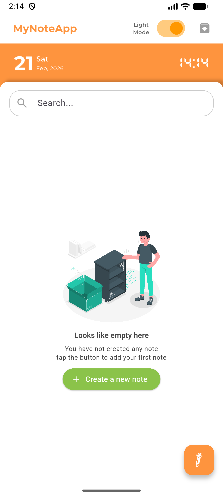
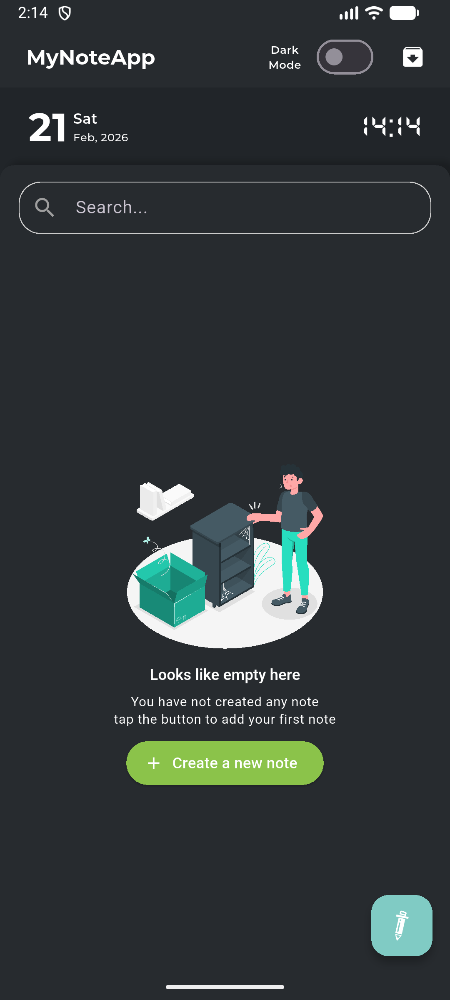
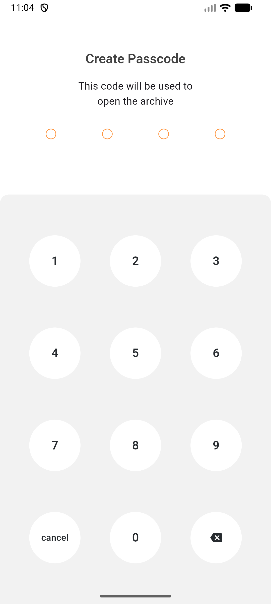
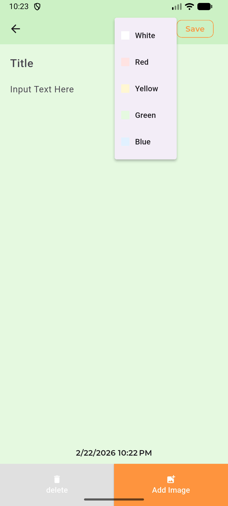

# NoteApp 📝

A creative and aesthetically pleasing note-taking application built with Flutter. Organize your thoughts, capture moments with images, and personalize your experience with a vibrant design.

## ✨ Features

- **Personalized Notes**: Assign unique colors to each note for better organization and visual appeal.
- **Image Integration**: Attach images to your notes directly from your gallery or camera.
- **Smart Layout**: Utilizes a staggered grid layout for a dynamic and modern user interface.
- **Rich Animations**: Smooth transitions and interactive elements powered by Rive and Flutter's animation package.
- **Local Storage**: Your data stays on your device using local SQLite database.
- **Digital Vibe**: Unique typography and dark-mode friendly design.

## 📸 Screenshots

```carousel

<!-- slide -->

<!-- slide -->

<!-- slide -->

```

## 🚀 Getting Started

### Prerequisites

Ensure you have the following installed on your local machine:

- [Flutter SDK](https://docs.flutter.dev/get-started/install) (version >= 3.0.0)
- [Dart SDK](https://dart.dev/get-dart) (version >= 3.0.0)
- Android Studio or VS Code with Flutter extensions.

### Installation

1. **Clone the repository:**

   ```bash
   git clone https://github.com/AloisiusBagas/NoteApp.git
   cd NoteApp
   ```

2. **Install dependencies:**

   ```bash
   flutter pub get
   ```

3. **Run the application:**
   ```bash
   flutter run
   ```

## 🛠️ Built With

- **Flutter** - UI Framework
- **Provider** - State Management
- **SQLite (sqflite)** - Local Database
- **Rive** - Interactive Animations
- **Staggered Grid** - Dynamic Layouts

## 💎 Assets & Acknowledgments

- **Animations**: [switch_daytime](https://rive.app/a/hoangnguyen/files/flare/switch_daytime/embed) by Hoang Nguyen.
- **Fonts**:
  - DS Digital
  - Montserrat (Bold, Medium, SemiBold)

---

_Developed with ❤️ by [Aloisius Bagas](https://github.com/AloisiusBagas)_
